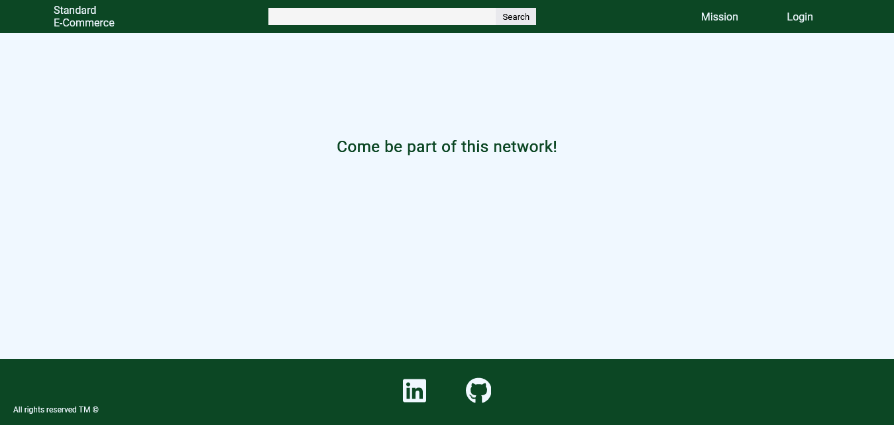

# Standard E-Commerce

This is a project for basic elements of an E-Commerce platform.

## Functionalities
* Register user.
* Login.

## How use?

1. Clone or Download the repository.
2. Open the project in your IDE.
3. Configure the application.properties file with your database information (for this project we use MySQL).
4. Run the **main** method in StandardecApplication.java (src/java/com/gvmmpg/standardec).
5. Open your browser with http://localhost:8080/.

### Application.properties

> spring.datasource.url=jdbc:mysql://localhost:[db port]/[database name]?createDatabaseIfNotExist=true
> spring.datasource.username=[your username]
> spring.datasource.password=[your password]

Temporary: You can also put the following configuration if you do not want to manually create the  database script.
> spring.jpa.hibernate.ddl-auto=update

## Configurations

### Dependencies
1. **spring-boot-starter-thymeleaf**: Java templating engine for processing HTML pages on the server side, facilitating the creation of dynamic web pages.
2. **thymeleaf-layout-dialect**: Adds support for layouts and fragments in Thymeleaf
3. **spring-boot-starter-web**: Includes essential components for building web applications
4. **spring-boot-devtools**: for automatic restart of the application.
5. **spring-boot-starter-test**: to facilitate writing and running unit, integration, and end-to-end tests
6. **spring-boot-starter-data-jpa**: Provides an abstraction layer over data access, allowing CRUD (Create, Read, Update, Delete) operations in relational databases.
7. **mysql-connector-j**: is the JDBC driver for MySQL.
8. **lombok**: is a Java library that helps reduce boilerplate code by automatically generating common code, such as getters, setters, constructors, and more, during the compilation process.

### Structure
* **configurarion**: here in the future we will adjust exceptions and security settings.
* **controller**: manage application logic, receiving requests and coordinating the execution of business logic.
* **domain**: contains the main entities, business rules, and persistence logic if using a database.

### Endpoints
* http://localhost:8080/public/home
* http://localhost:8080/public/login
* http://localhost:8080/public/userRegister

## Preview

